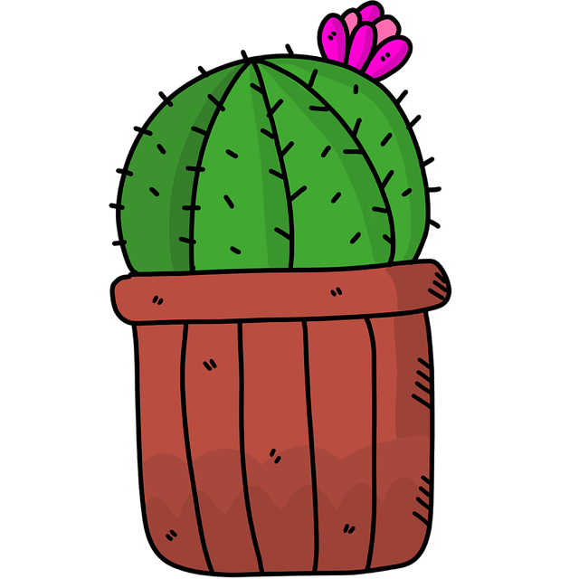

**Kactus** is a godog library to help write cleaner tests.

<!-- TOC -->

- [Get it](#get-it)

<!-- /TOC -->

## Get it

- `go get github.com/elmagician/kactus`

## Features

###### Credit

Logo: Image
par <a href="https://pixabay.com/fr/users/Katillustrationlondon-10871763/?utm_source=link-attribution&amp;utm_medium=referral&amp;utm_campaign=image&amp;utm_content=4294916">
Katherine Ab</a>
de <a href="https://pixabay.com/fr/?utm_source=link-attribution&amp;utm_medium=referral&amp;utm_campaign=image&amp;utm_content=4294916">
Pixabay</a>
